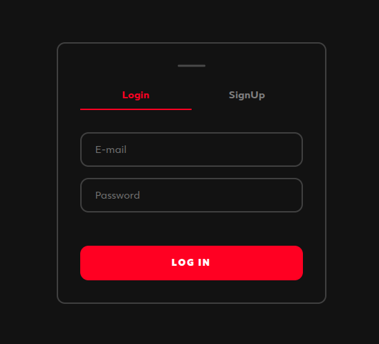
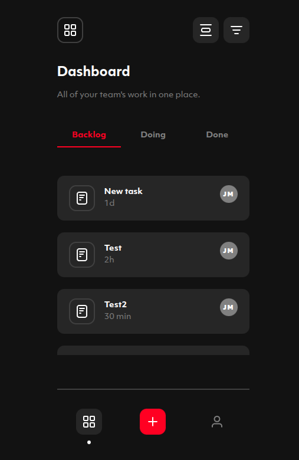
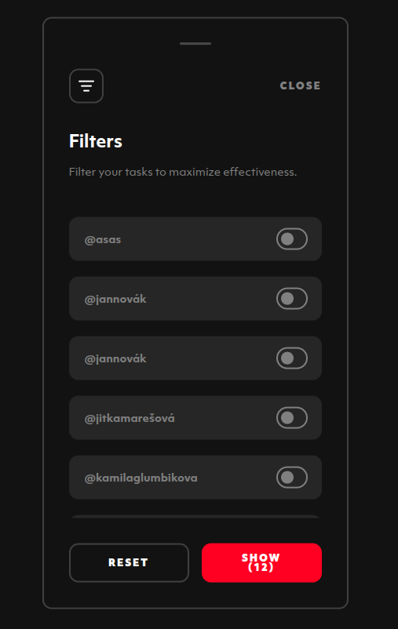
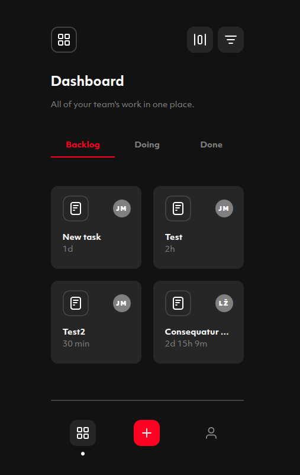
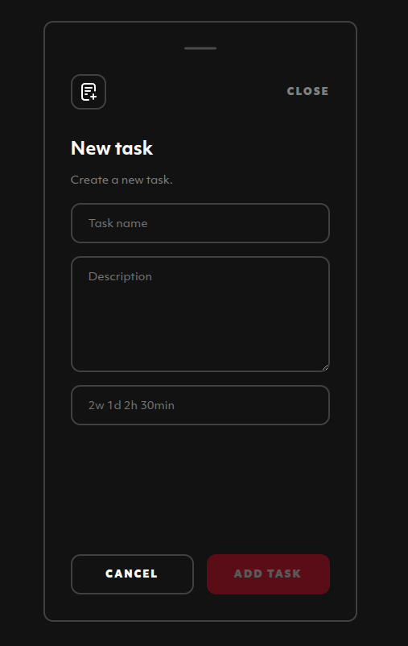
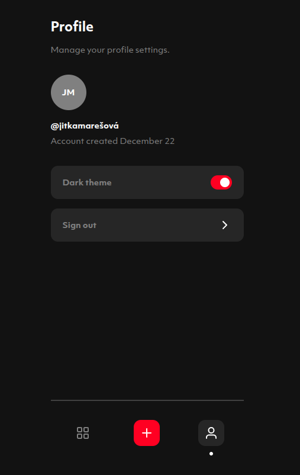

# Task Manager – Technical Assignment for Edgy.digital

This project is a task management web application developed as part of a **technical assignment** during a recruitment process for **Edgy.digital**, a digital agency.

The application was built based on provided specifications and showcases a clean, responsive user interface for creating and managing tasks.

Tech stack: **React**, **TypeScript**, **Vite**, `styled-components`, and `zustand`.

## What was done

- ### Feature 1: Login and Authorized State
      - login
      - sign up
      - refresh

      

- ### Feature 2: Task List
      - dashboard page
      - filter tasks by author    
      - toggle view mode

- ### Feature 3: Task Creation
      - task creation modal       

- ### Feature 4: Profile
      - profile page
      - logout
      - toggle light/dark mode

